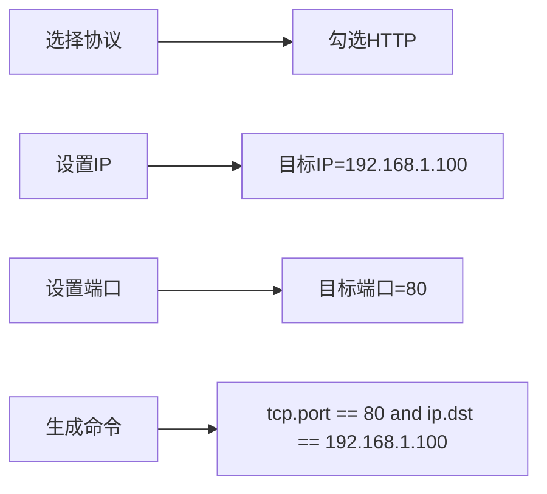
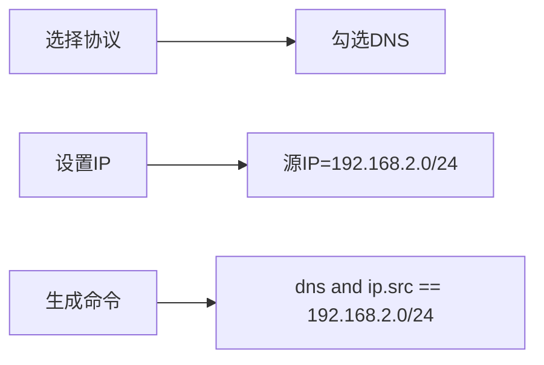
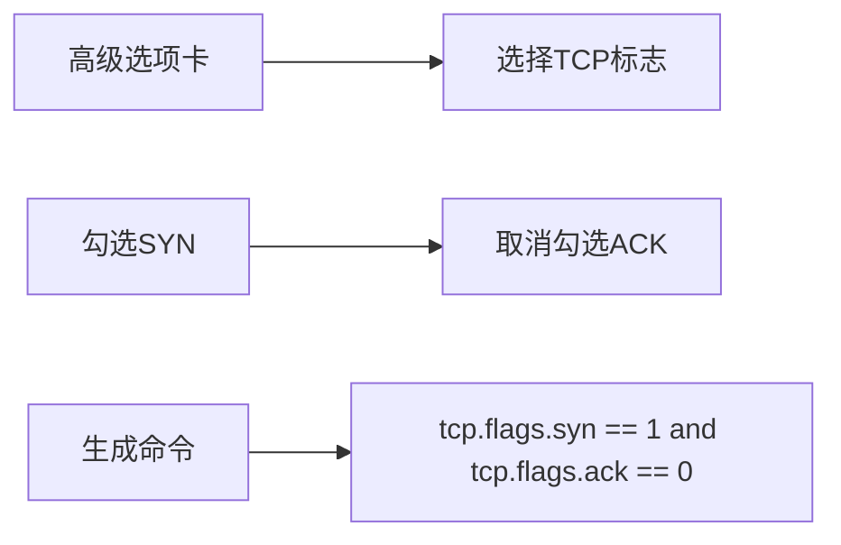
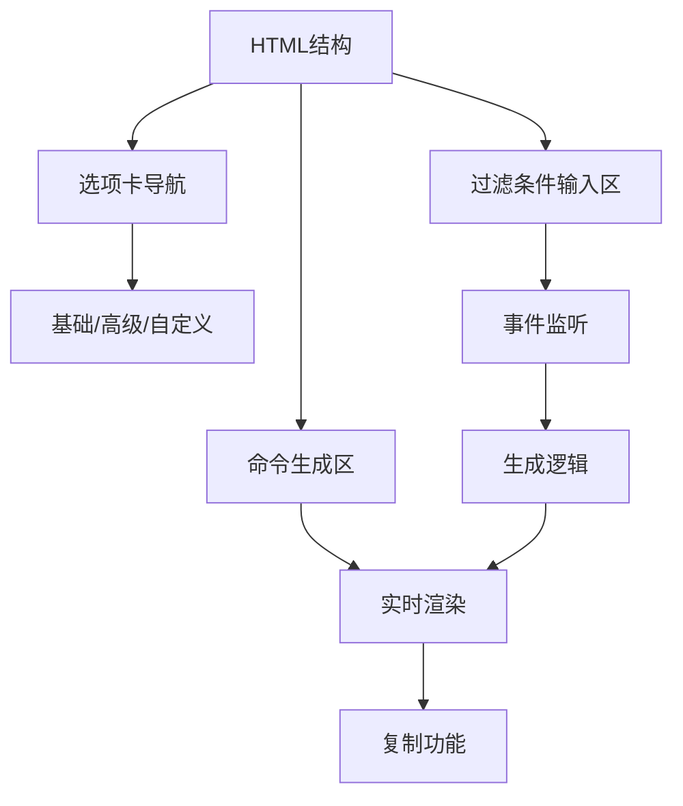

# 🌐 Wireshark过滤命令生成器

<p align="center">
  
  
  
</p>

> 可视化工具，帮助网络安全专业人员和开发者轻松生成复杂的Wireshark过滤表达式

**Wireshark过滤命令生成器**是一个直观的Web应用，通过图形界面简化了Wireshark过滤表达式的创建过程。无需记忆复杂的语法规则，只需选择所需条件，即可实时生成专业的过滤命令。

在线体验：[https://yourdomain.com/wireshark-filter-generator](https://yourdomain.com/wireshark-filter-generator)


## ✨ 核心功能

### 📊 多维度过滤选项
- **协议过滤**：TCP、UDP、HTTP、HTTPS、DNS等12+协议
- **IP地址过滤**：支持精确匹配和子网范围（/24, /16）
- **端口过滤**：源端口/目标端口，内置常用端口快速选择
- **数据包属性**：按长度范围过滤数据包
- **TCP标志**：SYN、ACK、FIN、RST等标志位过滤

### 🔍 高级搜索功能
- **关键字搜索**：支持多种编码格式（UTF-8、Unicode、Base64等）
- **日期范围**：按时间范围过滤数据包
- **相对时间**：按时间间隔过滤数据包

### ⚡ 效率工具
- **常用过滤器**：一键应用常见过滤场景
- **实时生成**：即时显示过滤命令结果
- **一键复制**：快速复制命令到剪贴板
- **自定义过滤**：支持直接输入高级表达式

## 🚀 快速使用

### 在线访问
直接访问：[https://yourdomain.com/wireshark-filter-generator](https://yourdomain.com/wireshark-filter-generator)

### 本地运行
```bash
# 克隆仓库
git clone https://github.com/Ouniel/wireshark-filter-generator.git

# 进入项目目录
cd wireshark-filter-generator

# 安装Live Server（如果尚未安装）
npm install -g live-server

# 启动本地服务器
live-server
```

## 🖥️ 界面导览

### 基础过滤选项卡

1. **协议选择**：勾选需要过滤的协议
2. **IP地址过滤**：设置源IP/目标IP及子网掩码
3. **端口过滤**：设置端口并选择常用端口
4. **日期范围**：设置开始和结束日期
5. **关键字搜索**：输入关键字并查看编码提示

### 高级过滤选项卡

1. **数据包属性**：设置最小/最大长度
2. **TCP标志**：选择需要过滤的TCP标志位
3. **时间过滤**：设置相对时间过滤

### 自定义过滤选项卡

- 直接输入复杂的过滤表达式
- 支持所有Wireshark过滤语法

## 🛠️ 使用示例

### 场景1：监控特定服务器的HTTP流量


### 场景2：捕获特定子网的DNS查询


### 场景3：检测SYN扫描攻击


## 💡 使用技巧

### 关键字搜索的多格式支持
| 编码格式 | 示例 | 使用场景 |
|----------|------|----------|
| **UTF-8** | `flag` | 普通文本搜索 |
| **Unicode** | `\u0066\u006c\u0061\u0067` | 避免编码问题 |
| **Base64** | `ZmxhZw==` | 二进制数据搜索 |
| **Hex** | `66 6c 61 67` | 精确字节匹配 |
| **Binary** | `01100110 01101100 01100001 01100111` | 底层数据分析 |

### 常用过滤器快捷列表
```bash
# HTTP流量
tcp.port == 80

# 特定IP通信
ip.addr == 192.168.1.1

# DNS查询
dns

# HTTP请求
http.request

# TCP SYN包
tcp.flags.syn == 1

# 排除ARP流量
!arp

# 长度大于500字节的数据包
frame.len > 500
```

## 🧩 技术实现

### 前端架构


### 核心功能逻辑
1. **事件监听**：监听所有输入控件的变更事件
2. **条件解析**：将UI选择转换为Wireshark过滤语法
3. **表达式组合**：使用逻辑运算符组合多个条件
4. **实时更新**：即时显示生成的过滤命令
5. **错误处理**：验证输入有效性并提供反馈

## 📜 许可协议

本项目采用 **MIT 许可证** - 详细信息请查看 [LICENSE](LICENSE) 文件。

### 主要条款
| 允许 | 要求 | 禁止 |
|------|------|------|
| ✅ 商业使用 | ❗ 保留版权声明 | 🚫 责任追究 |
| ✅ 修改分发 | ❗ 包含许可副本 | 🚫 商标使用 |
| ✅ 私人使用 | - | 🚫 担保承诺 |


---
**让网络分析更高效** - 可视化生成专业的Wireshark过滤命令 🔍
