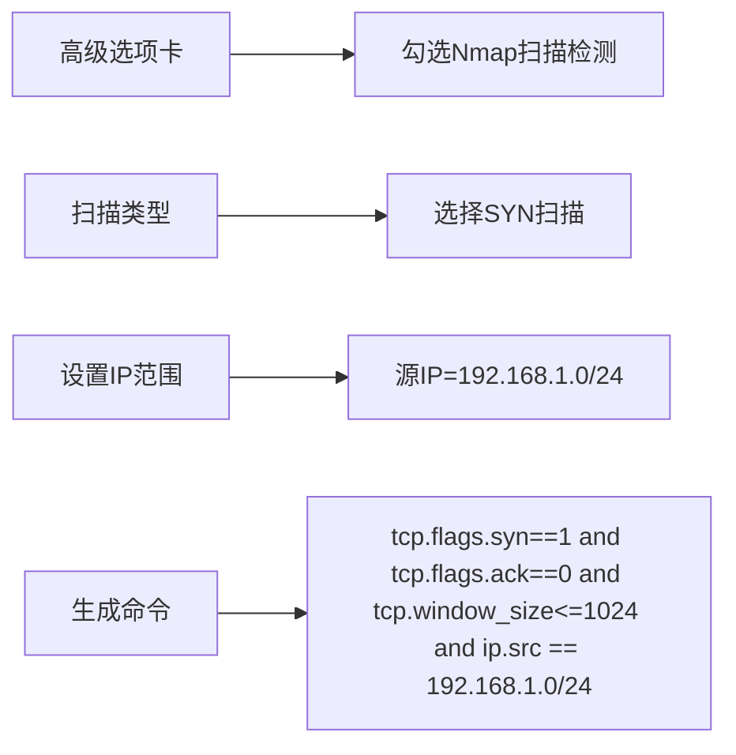
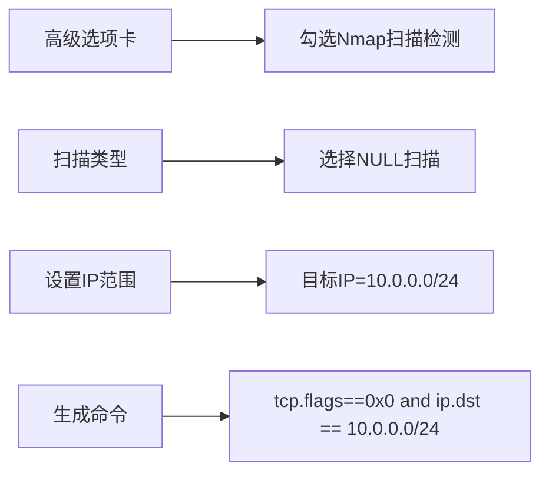
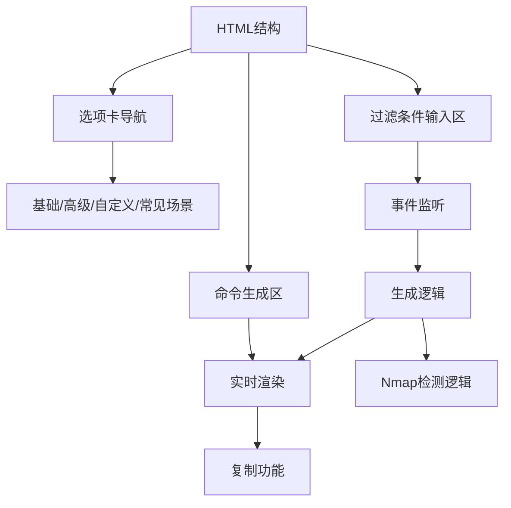

# 🌐 Wireshark过滤命令生成器

<p align="center">
  
  
  
  
</p>

> 可视化工具，帮助网络安全专业人员和开发者轻松生成复杂的Wireshark过滤表达式，特别增强Nmap扫描检测能力

**Wireshark过滤命令生成器**是一个直观的Web应用，通过图形界面简化了Wireshark过滤表达式的创建过程。无需记忆复杂的语法规则，只需选择所需条件，即可实时生成专业的过滤命令。增强版特别添加了Nmap扫描检测功能，帮助网络安全人员快速识别扫描活动。

在线体验：[https://yourdomain.com/wireshark-filter-generator](https://yourdomain.com/wireshark-filter-generator)


## ✨ 核心功能

### 📊 多维度过滤选项
- **协议过滤**：TCP、UDP、HTTP、HTTPS、DNS等12+协议
- **IP地址过滤**：支持精确匹配和子网范围（/24, /16）
- **端口过滤**：源端口/目标端口，内置常用端口快速选择
- **数据包属性**：按长度范围过滤数据包
- **TCP标志**：SYN、ACK、FIN、RST等标志位过滤
- **Nmap扫描检测**：SYN扫描、NULL扫描、FIN扫描、XMAS扫描等

### 🔍 高级搜索功能
- **关键字搜索**：支持多种编码格式（UTF-8、Unicode、Base64等）
- **日期范围**：按时间范围过滤数据包
- **相对时间**：按时间间隔过滤数据包
- **扫描特征过滤**：检测Nmap特定扫描模式

### ⚡ 效率工具
- **常用过滤器**：一键应用常见过滤场景
- **实时生成**：即时显示过滤命令结果
- **一键复制**：快速复制命令到剪贴板
- **自定义过滤**：支持直接输入高级表达式
- **历史记录**：保存和重用常用过滤命令

## 🚀 快速使用

### 在线访问
直接访问：[https://yourdomain.com/wireshark-filter-generator](https://yourdomain.com/wireshark-filter-generator)

### 本地运行
```bash
# 克隆仓库
git clone https://github.com/Ouniel/wireshark-filter-generator.git

# 进入项目目录
cd wireshark-filter-generator

# 安装Live Server（如果尚未安装）
npm install -g live-server

# 启动本地服务器
live-server
```

## 🖥️ 界面导览

### 基础过滤选项卡

1. **协议选择**：勾选需要过滤的协议
2. **IP地址过滤**：设置源IP/目标IP及子网掩码
3. **端口过滤**：设置端口并选择常用端口
4. **日期范围**：设置开始和结束日期
5. **关键字搜索**：输入关键字并查看编码提示

### 高级过滤选项卡（新增Nmap检测）

1. **Nmap扫描检测**：勾选检测Nmap扫描活动
2. **扫描类型选择**：SYN扫描、NULL扫描、FIN扫描等
3. **IP范围设置**：指定扫描源或目标IP范围
4. **数据包属性**：设置最小/最大长度
5. **TCP标志**：选择需要过滤的TCP标志位
6. **时间过滤**：设置相对时间过滤

### 常见场景选项卡

- **Nmap扫描检测**：一键应用Nmap扫描检测预设
- 压缩包提取
- 恶意软件检测
- 数据外泄检测
- DNS隧道检测
- Web Shell检测

## 🛠️ 使用示例

### 场景1：检测Nmap SYN扫描


### 场景2：检测Nmap NULL扫描


### 场景3：检测所有类型的Nmap扫描
```mermaid
graph LR
    A[常见场景选项卡] --> B[点击Nmap扫描检测卡片]
    C[自动生成命令] --> D[(tcp.flags.syn==1 and tcp.flags.ack==0) or (tcp.flags==0x0) or (tcp.flags.fin==1 and tcp.flags.ack==0) or (tcp.flags.fin==1 and tcp.flags.urg==1 and tcp.flags.psh==1)]
```

## 💡 使用技巧

### Nmap扫描特征识别表
| 扫描类型 | 特征描述 | 过滤表达式 |
|----------|----------|------------|
| **SYN扫描** | SYN标志位设置而ACK未设置，窗口大小通常小于1024 | `tcp.flags.syn==1 and tcp.flags.ack==0 and tcp.window_size<=1024` |
| **NULL扫描** | 所有TCP标志位均为0 | `tcp.flags==0x0` |
| **FIN扫描** | 仅FIN标志位设置 | `tcp.flags.fin==1 and tcp.flags.ack==0` |
| **XMAS扫描** | FIN、URG和PSH标志位同时设置 | `tcp.flags.fin==1 and tcp.flags.urg==1 and tcp.flags.psh==1` |
| **ACK扫描** | 仅ACK标志位设置 | `tcp.flags.ack==1 and tcp.flags.syn==0` |

### Nmap扫描分析提示
1. 扫描源IP通常会在短时间内发送大量探测包
2. 使用"Statistics > Conversations"功能分析流量最大的IP
3. 结合IP地理定位信息判断扫描源是否可疑
4. Nmap扫描通常有多个端口快速扫描的特征
5. 扫描目标IP通常是连续或子网范围内的地址

### 常用Nmap检测过滤器
```bash
# 检测所有类型的Nmap扫描
(tcp.flags.syn==1 and tcp.flags.ack==0) or 
(tcp.flags==0x0) or 
(tcp.flags.fin==1 and tcp.flags.ack==0) or 
(tcp.flags.fin==1 and tcp.flags.urg==1 and tcp.flags.psh==1)

# 检测SYN扫描（最常用）
tcp.flags.syn==1 and tcp.flags.ack==0 and tcp.window_size<=1024

# 检测NULL扫描
tcp.flags == 0x0

# 检测FIN扫描
tcp.flags.fin==1 and tcp.flags.ack==0

# 检测XMAS扫描
tcp.flags.fin==1 and tcp.flags.urg==1 and tcp.flags.psh==1
```

## 🧩 技术实现

### 前端架构


### Nmap检测核心逻辑
1. **扫描类型识别**：根据用户选择的扫描类型生成对应特征表达式
2. **IP范围处理**：支持CIDR表示法的IP范围过滤
3. **特征组合**：使用OR逻辑组合多种扫描类型的检测条件
4. **性能优化**：确保复杂表达式不影响界面响应速度
5. **历史记录**：保存常用的Nmap检测表达式

## 📜 许可协议

本项目采用 **MIT 许可证** - 详细信息请查看 [LICENSE](LICENSE) 文件。

### 主要条款
| 允许 | 要求 | 禁止 |
|------|------|------|
| ✅ 商业使用 | ❗ 保留版权声明 | 🚫 责任追究 |
| ✅ 修改分发 | ❗ 包含许可副本 | 🚫 商标使用 |
| ✅ 私人使用 | - | 🚫 担保承诺 |

---

**让网络分析更高效** - 可视化生成专业的Wireshark过滤命令，增强Nmap扫描检测能力 🔍🛡️
