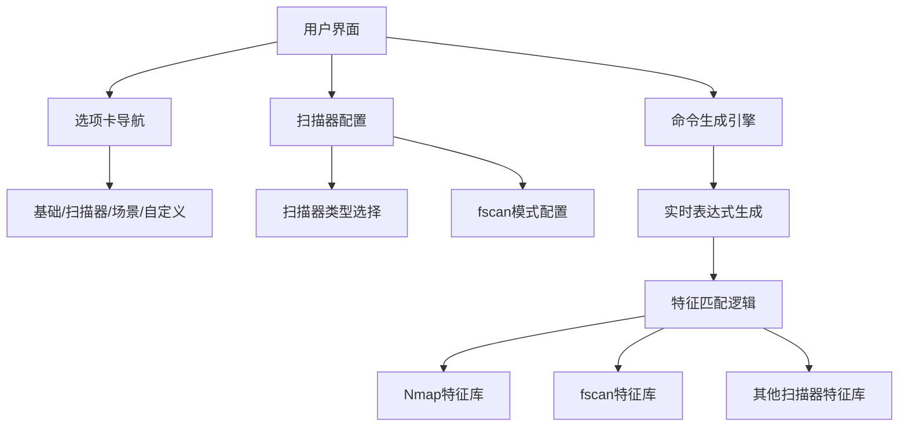

# 🌐 Wireshark过滤命令生成器

<p align="center">
  
  
  
  
</p>

> 可视化工具，帮助网络安全专业人员轻松生成Wireshark过滤表达式，增强扫描器检测能力

**Wireshark过滤命令生成器**是一个强大的Web应用，通过直观的图形界面简化了Wireshark过滤表达式的创建过程。特别强化了扫描器检测能力，支持Nmap、fscan、Masscan等常见扫描器的识别，帮助安全团队快速发现网络扫描活动。


## ✨ 核心功能

### 🔍 全面扫描器检测
- **Nmap检测**：SYN扫描、NULL扫描、FIN扫描、XMAS扫描等
- **fscan检测**：主机发现、端口扫描、漏洞利用模式
- **其他扫描器**：Masscan高速扫描、Hydra暴力破解、Metasploit攻击检测
- **漏洞特征**：永恒之蓝、SMBGhost、WebLogic漏洞等

### 📊 多维度过滤选项
- **协议过滤**：TCP、UDP、HTTP、HTTPS、DNS等12+协议
- **IP地址过滤**：支持精确匹配和子网范围（/24, /16）
- **端口过滤**：源端口/目标端口，内置常用端口快速选择
- **数据包属性**：按长度范围过滤数据包
- **TCP标志**：SYN、ACK、FIN、RST等标志位过滤
- **文件提取**：支持ZIP、PDF、EXE等文件特征提取

### ⚡ 效率工具
- **一键场景**：预置常见扫描检测场景
- **实时生成**：即时显示过滤命令结果
- **历史记录**：保存和重用常用过滤命令
- **配置导出**：保存扫描器检测配置
- **多端适配**：完美适配桌面和移动设备

## 🚀 快速使用

### 在线访问
直接访问：[https://yourdomain.com/wireshark-scanner-detection](https://yourdomain.com/wireshark-scanner-detection)

### 本地运行
```bash
# 克隆仓库
git clone https://github.com/yourrepo/wireshark-scanner-detection.git

# 进入项目目录
cd wireshark-scanner-detection

# 安装Live Server（如果尚未安装）
npm install -g live-server

# 启动本地服务器
live-server
```

## 🖥️ 界面导览

### 基础过滤选项卡

1. **协议选择**：勾选需要过滤的协议
2. **IP地址过滤**：设置源IP/目标IP及子网掩码
3. **端口过滤**：设置端口并选择常用端口
4. **关键字搜索**：输入关键字并查看编码提示

### 扫描器检测选项卡（新增）

1. **扫描器选择**：fscan、Masscan、Hydra等扫描器
2. **fscan模式**：主机发现、端口扫描、漏洞利用
3. **目标范围**：指定扫描目标IP范围
4. **漏洞检测**：选择特定漏洞进行检测
5. **行为特征**：高速扫描、多协议扫描等异常行为

### 场景示例选项卡

- **fscan扫描检测**：一键检测内网fscan扫描
- **Nmap扫描检测**：识别各类Nmap扫描技术
- **Hydra暴力破解**：检测SSH/FTP暴力破解
- **Masscan高速扫描**：识别高速端口扫描
- **SQL注入扫描**：检测SQL注入攻击行为

## 🛠️ 使用示例

### 场景1：检测fscan内网扫描
```mermaid
graph LR
    A[扫描器检测选项卡] --> B[勾选fscan扫描器]
    C[扫描模式] --> D[选择"所有模式"]
    E[目标范围] --> F[输入192.168.1.0/24]
    G[生成命令] --> H[(icmp or arp) and ip.dst==192.168.1.0/24 or (tcp.flags.syn==1 and tcp.flags.ack==0 and tcp.dstport in {135,139,445,22,21,1433,3306,3389})]
```

### 场景2：检测Hydra暴力破解
```mermaid
graph LR
    A[场景示例选项卡] --> B[点击Hydra暴力破解卡片]
    C[自动生成命令] --> D[((tcp.dstport == 22 and ssh) or (tcp.dstport == 21 and ftp)) and frame contains "password"]
```

### 场景3：检测Masscan高速扫描
```mermaid
graph LR
    A[扫描器检测选项卡] --> B[勾选Masscan扫描器]
    C[行为特征] --> D[选择"高速端口扫描"]
    E[生成命令] --> F[tcp.flags.syn==1 and tcp.flags.ack==0 and frame.time_delta < 0.001]
```

## 💡 扫描器特征识别

### 常见扫描器特征表
| 扫描器类型       | 特征描述                         | 过滤表达式                                                               |
| ---------------- | -------------------------------- | ------------------------------------------------------------------------ |
| **fscan**        | ICMP/ARP主机发现 + 多端口扫描    | `(icmp or arp) and tcp.dstport in {135,139,445,22,21,1433,3306,3389}`    |
| **Nmap SYN扫描** | SYN标志位设置而ACK未设置，小窗口 | `tcp.flags.syn==1 and tcp.flags.ack==0 and tcp.window_size<=1024`        |
| **Masscan**      | 极短时间内大量SYN包              | `tcp.flags.syn==1 and frame.time_delta < 0.001`                          |
| **Hydra**        | 同一端口多次认证尝试             | `(tcp.dstport == 22 or tcp.dstport == 21) and frame contains "password"` |
| **Metasploit**   | 包含特定Payload特征              | `tcp.payload matches "\\x90\\x90\\x90\\x90"`                             |

### 扫描器分析技巧
1. **fscan特征**：
   - 同时使用ICMP和ARP探测
   - 快速扫描多个常见端口（SMB, SSH, FTP等）
   - 尝试多种漏洞利用Payload

2. **Nmap扫描分析**：
   - 短时间内发送大量探测包
   - 使用"Statistics > Conversations"分析流量
   - 结合IP地理定位判断可疑性

3. **暴力破解识别**：
   - 同一账户多次认证尝试
   - 短时间内大量失败登录
   - 使用常见用户名/密码组合

## 🧩 技术实现

### 前端架构


### 核心检测逻辑
1. **特征匹配引擎**：根据选择的扫描器加载对应特征
2. **模式识别**：fscan支持主机发现、端口扫描、漏洞利用模式
3. **异常行为检测**：识别高速扫描、多协议扫描等行为
4. **漏洞特征库**：内置常见漏洞检测特征
5. **IP范围处理**：支持CIDR表示法的IP范围过滤

## 📜 许可协议

本项目采用 **MIT 许可证** - 详细信息请查看 [LICENSE](LICENSE) 文件。

### 主要条款
| 允许       | 要求           | 禁止       |
| ---------- | -------------- | ---------- |
| ✅ 商业使用 | ❗ 保留版权声明 | 🚫 责任追究 |
| ✅ 修改分发 | ❗ 包含许可副本 | 🚫 商标使用 |
| ✅ 私人使用 | -              | 🚫 担保承诺 |

---

**让网络威胁无处遁形** - 快速识别各类扫描器活动，提升网络安全防护能力 🔍🛡️
